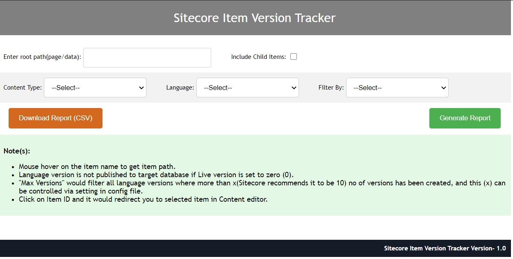
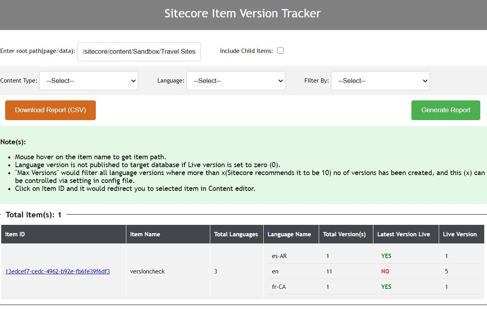

# sitecore-item-version-tracker

Sitecore Item Version Tracker

This tool is to get details around different language versions created, which version is still not published, if any specific version has more than 10 numbered version created and so on..

1) How many language version exists for a particular item.
2) How many numbered versions exists for particular language version.
3) To get list of items which are still not published.
4) To get the language versions where the no of versions are greater than 10 (this is what Sitecore recommends)- this can be changed if required in the tool.
5) Provide an option to download the report which then can be shared with concerned person(s) to make necessary changes

## RELEASE NOTES
This package installs the following to your Sitecore instance:- 

•	\bin\Sitecore.SharedSource.ItemVersionTracker.dll

•	\sitecore\admin\ItemVersionTracker.aspx

•	\App_Config\Include\Feature\Sitecore.SharedSource.ItemVersionTracker.Settings.config

## How to use

Once the package is installed- tool can be accessed here- http://yourhostname/sitecore/admin/ItemVersionTracker.aspx

**How to Use:**

It has following parameters:

1) **Root Path–** This contains the root path of the item which you want to check, this also support item GUID.
2) **Include Child Items-** Checkbox to include child items also.
3) **Content Type-** Content Type filter has been added to filter it based on Page/Non-page items like data items/module/image items etc..
4) **Language-** Language filter to get item details based on specific language, this would show all the languages available under System->Languages.
5) **Filter By-** here we have two filters available:
5.1) **“Latest Version is not published“-** This would list down all the language version items which is still not published to target database.
5.2) **“Max Version“-** This would filter all those language versions where more than 10 (this can be changed) versions has been created.

For example- If I want to test an item which is created under Home item and has multiple language versions, this is how it looks.

The listing has following details:

1) **Item ID-** This is Item ID which user can click and navigate directly to content editor.
2) **Item Name–** Name of the Item.
3) **Total Language(s)–** This shows how many language versions exists for the selected Item- from the above screen shot we can see that three (3) language versions exists, “es-AR“,”en” and “fr-CA“.
4) **Language Name-** Name of the language.
5) **Total Version(s)-** This gives a count of how many numbered versions exists for a particular language version.
6) **Latest Version Live–** This shows if the latest version exists in Source DB (master) has been published or not.
7) **Live Version-** This give the language version no. which is published to live database.

If we include child items also by checking **“Include Child Items”** this is what we would see.

If we want to get all the language versions where more than 10 numbered versions exists we can select “Filter By” -> Max Versions, you can change the max version count by updating the same in “Sitecore.SharedSource.ItemVersionTracker.Settings.config“

**Download the Report**

To download the report- just select the values and filters and click on "Download Report (CSV)" button.

## Screen shots

### Sitecore Item Version Tracker

